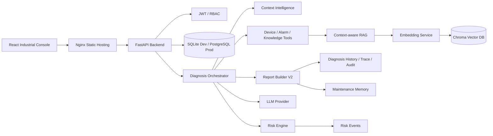
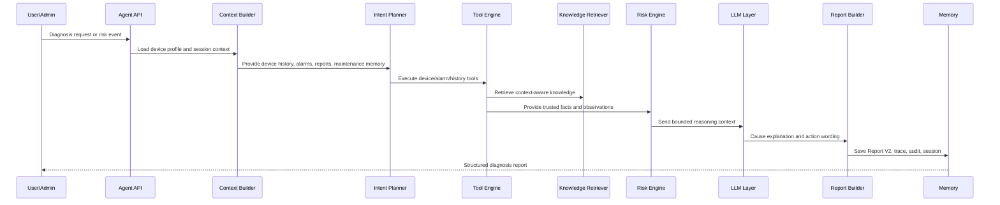
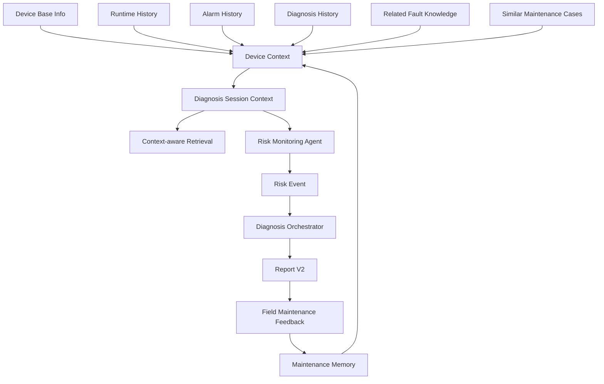
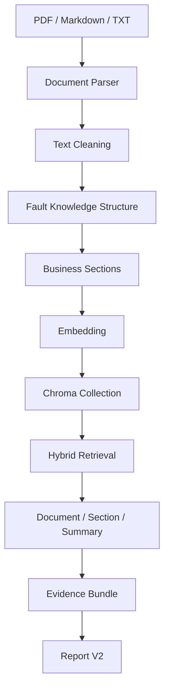
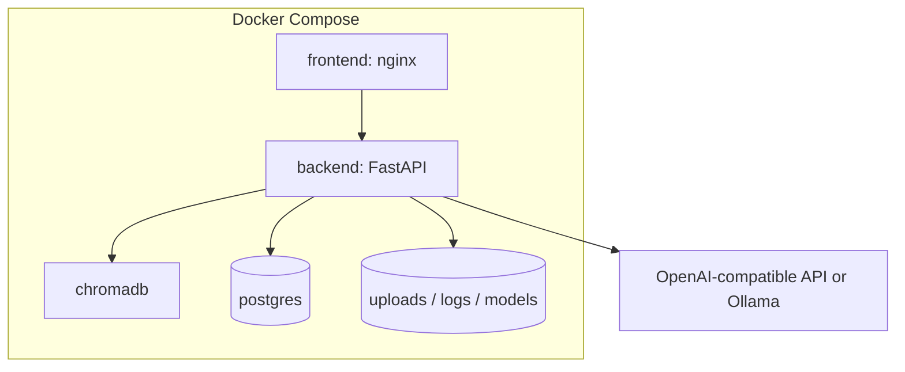

# Enterprise AI Agent Platform Architecture

## System Overview

## Product Positioning

Enterprise AI Agent Platform is an industrial equipment intelligent operations platform. It supports the full maintenance loop:

1. Device status sensing
2. Risk discovery
3. Agent planning
4. Tool execution
5. Context-aware knowledge retrieval
6. Evidence aggregation
7. Report V2 generation
8. Field maintenance feedback
9. Maintenance memory accumulation

## Request Data Flow

1. User or Admin opens the React console.
2. FastAPI validates JWT/RBAC and opens a SQLAlchemy session.
3. Diagnosis Orchestrator loads Device Context and creates Diagnosis Session Context.
4. Intent Planner decides what data is required.
5. Tool Execution Engine reads device status, alarms, knowledge, and maintenance memory.
6. Evidence Aggregator normalizes trusted facts.
7. Risk Engine calculates risk level and score.
8. Context-aware RAG retrieves maintenance manuals, fault knowledge, and historical cases.
9. LLM Reasoning Layer expresses causes and recommendations from trusted evidence only.
10. Report Builder V2 persists the final business report.
11. Maintenance Memory and Risk Monitoring feed future device context.

## Agent Diagnosis Flow

## Context Intelligence

## RAG Pipeline

## User Roles

| Role | Product Focus | Visible Capabilities |
| --- | --- | --- |
| User | Operations execution | Dashboard, device profile, AI risk events, diagnosis reports, maintenance records |
| Admin | Platform governance | All User capabilities plus diagnosis execution, knowledge management, risk scanning, system settings |

The backend remains compatible with legacy `viewer` and `engineer` records. The frontend normalizes them into the simpler User/Admin product model for enterprise demonstrations.

## Deployment Topology

## Demo Story

1. User opens Dashboard and sees abnormal devices and pending alarms.
2. User opens Device Detail Center for `DEV-003` and sees current E101 alarm, health trend, diagnosis history, knowledge links, and maintenance memory.
3. User opens AI Operations Center and sees proactive risk events for temperature, vibration, and communication risks.
4. User opens Smart Service Reports and reviews a Report V2 diagnosis with facts, causes, verification steps, actions, and knowledge citations.
5. Admin uploads or refreshes maintenance manuals in Knowledge Center.
6. Admin triggers diagnosis/risk scanning and saves field handling results in Maintenance Loop.
7. The saved maintenance result becomes future device context and improves the next diagnosis.
